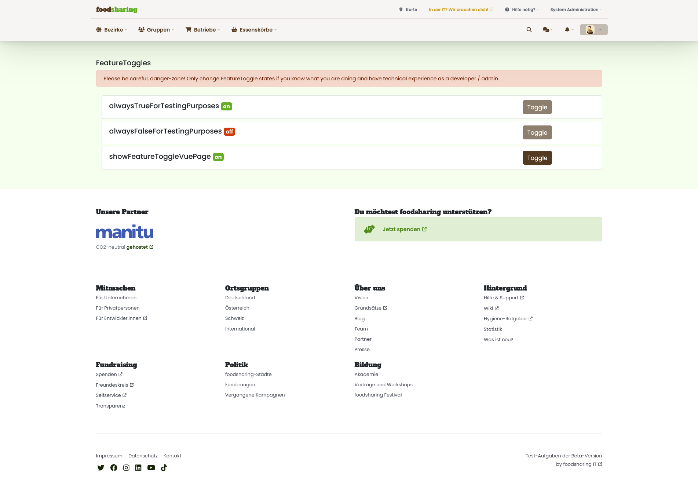

# Feature toggles
Feature toggles are a technique in software engineering to control the release of new features in an application. It is a switch function that allows new features to be temporarily enabled or disabled to control the impact on the application and user experience.

They can be used to test different variations of a feature to evaluate their effectiveness or popularity with users before they are fully rolled out. They can also be used to enable certain features only for certain groups of users, such as testers or early adopters.

In addition, feature toggles can also be used to react quickly to problems or malfunctions by simply deactivating the affected feature while the problem is being fixed. Feature toggles are thus a powerful tool to increase flexibility, control and security in software development and deployment.

:::info Use feature toggles only for features that
- has a big impact on the current use of foodsharing
- there might be data inconsistencies when releasing for beta / prod
- replace larger features (to switch back in case of emergency)
:::

## We are using feature toggles, if ..
- the feature is not yet fully tested and ready for release, it can be hidden behind a feature toggle until it is fully tested and ready.

- the feature is under development, and it has not yet been finally decided whether it should be permanently available in the application, it can be hidden behind a feature toggle to see how it is used by users before it is finally activated.

- the feature is available only on several environments like local dev / beta / production

:::info Later it should be possible to (not possible yet)
- made features available to a specific group of users, it can be hidden behind a feature toggle until it is activated for that group of users like beta-tester
- a/b testing
:::

## How to create feature toggles
1. navigate to `FeatureToggleDefinitions.php`
2. add your feature toggle with a meaningful identifier
3. run the symfony-command to update the feature toggles `foodsharing:update:featuretoggles` or visit `/featuretoggles` as orga user

As example, i added a feature toggle to show the newest design for our documentation:
```php title='src/Modules/Development/FeatureToggles/Enums/FeatureToggleDefinitions.php'
<?php

declare(strict_types=1);

namespace Foodsharing\Modules\Development\FeatureToggles\Enums;

/**
 * For each feature toggle, please add an enum case in SCREAMING_SNAKE_CASE with same name as value in lowerCamelCase.
 * After adding or removing some feature toggle definition, please run the command foodsharing:update:featuretoggles.
 * For more description and usage about feature toggles, please visit the devdocs.
 */
enum FeatureToggleDefinitions: string
{
    case SHOW_NEWEST_DEVDOCS_DESIGN = 'showNewestDevdocsDesign';
    
    /**
     * Returns all feature toggle identifiers.
     *
     * @return array<int, string>
     */
    public static function all(): array
    {
        $definitions = array_column(self::cases(), 'value');

        return array_values($definitions);
    }
}

```

## How to use feature toggles / check if feature toggle is active
Let's see how we can check in our code, if a feature toggle is active.
### PHP
1. Inject via [symfony autowiring](https://symfony.com/doc/current/service_container/autowiring.html) the interface `FeatureToggleChecker (Foodsharing\Modules\Development\Featuretoggles\DependencyInjection\FeatureToggleChecker)`
2. Use the method `isFeatureToggleActive($featureToggleIdentifier)`
```php title='FeatureToggleRestController.php'
final class FeatureToggleRestController extends AbstractFOSRestController
{
    public function __construct(
        private readonly FeatureToggleChecker $featureToggleChecker,
    ) {
    }

    public function isFeatureToggleActiveAction(): JsonResponse
    {
        $isFeatureToggleActive = $this->featureToggleChecker->isFeatureToggleActive(FeatureToggleDefinitions::SHOW_NEWEST_DEVDOCS_DESIGN->value);
        ...
    }
}
```
### VueJS
1. define one boolean attribute to check your feature toggle state (tip: start with `is`) with default value `null`
2. inside `async mounted()` assign `await this.$isFeatureToggleActive('...')` your defined boolean-variable
```js title='FancyComponent.vue'
<template>
  <div>
    <p v-if="isMyFeatureToggleActive">We have some news for you: new devdocs design</p>
    <p v-else>At this moment, we don't have any news for you.</p>
  </div>
</template>

<script>
    
export default {
  data () {
    return {
        isMyFeatureToggleActive: null,
        featureToggles: [],
    }
  },
  async mounted () {
    this.isMyFeatureToggleActive = await this.$isFeatureToggleActive('showNewestDevdocsDesign')
  },
  computed: {
    isMyFeatureToggleActive () {
      return this.isFeatureToggleActive('showNewestDevdocsDesign')
    },
  },
}
</script>
```

### Twig
`isFeatureToggleActive('...')` is a global twig-function, you can use and call it everywhere inside twig
```twig

    <!-- Do something -->

```

## How to toggle feature toggles
1. be a user with orga permission
2. visit `/featuretoggles`

The page should be like this:

