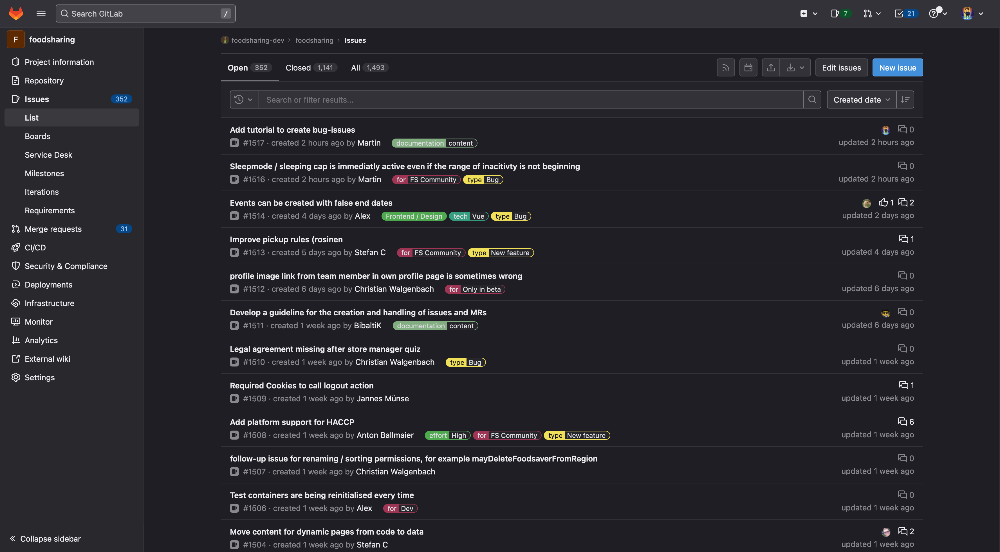
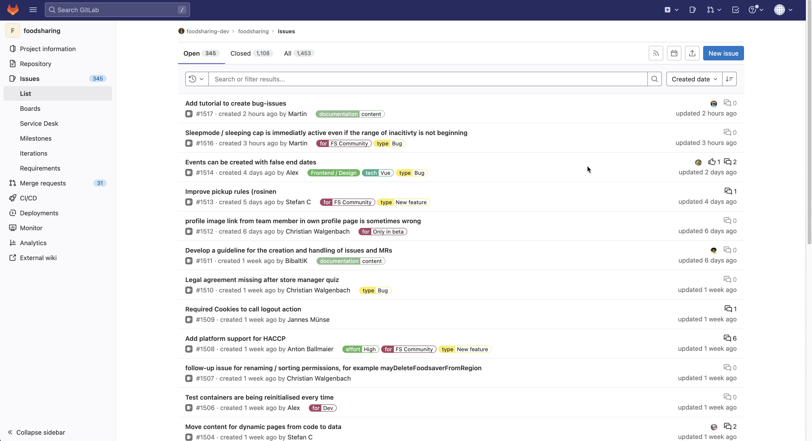
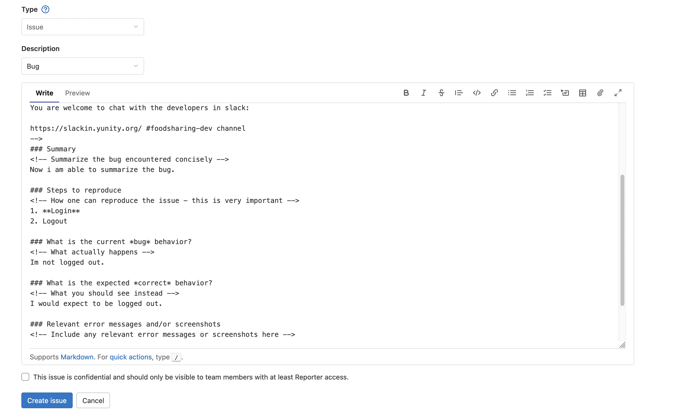

# Create a bug ticket for developers

Bugs are unexpected behaviours on the foodsharing platforms. To work on it as a developer, it's important to receive multiple information about a specific problem. Here you find a tutorial to create a bug ticket for the developers of the foodsharing plattforms.

:::note
You need a GitLab account for this action. The tutorial expects that you have a GitLab account and you are logged in.
:::

## Step 1: Find a bug

To report a bug, you need a specific unexpected behaviour. To find someone, you have multiple options:

1. try out yourself and find a bug while using foodsharing
2. lookup in the Betatester forum and check out some threads to read about bugs

:::info Betatester forum
The Betatester forum is available as a member of the global working group *Beta-Tester*.
:::

## Step 2: Gather some information about the bug and write them down

:::info Check if the bug is already fixed
If the bug is on our production foodsharing platform (https://foodsharing.network), you can try to reproduce the bug on our beta foodsharing platform (https://beta.foodsharing.de)

**If you can't reproduce the bug, the bug is already fixed in the new version of foodsharing and you do not need to create a bug ticket. 🎉**
:::

The more information we as developers can utilize, the faster the bug could be solved. Please write this down:

1. **Summary of the bug:** *Please describe the bug in one or two sentences*
2. **Steps to reproduce:** *Please provide a step-by-step list so we can reproduce the bug (I'm logged in as foodsharer, than clicked on a foodshare point, ...)*
3. **Current behaviour/situation:** *Please provide how the functionality / design / behaviour is at this moment?*
4. **Expected behaviour/situation:** *Please describe the expected funcionality / design / behaviour*

### Screenshots, GIFs and more would be awesome!
Maybe you can add one or more screenshots of the bug or you record a GIF to show us your view directly. The media and the provided information would be very helpful.

## Step 3: Create the bug ticket

Now you have enough content and information to create a bug ticket. On GitLab, a bug ticket is known as an issue. Now we are creating your ticket step by step with GitLab.

### Visit our place for bug tickets
Open a new tab and visit https://gitlab.com/foodsharing-dev/foodsharing/-/issues

You should see an overview about many issues like this:

### Prepare a new issue for a bug
To create a new bug ticket, please click the "New Issue"-button in the top right corner and select the template *Bug*. This is a general template for bugs. Click *Apply template* to overwrite the default text in the description section.

Now you have a template to insert your information.

### Fill out the template with your information from Step 2

Now you can provide your information in the issue. Simply write down your gathered information from Step 2 and click on the *Preview*-Button to check if your formatting is readable and understandable.

:::caution
If you write anything between `<!-- -->`, you can't see it. These are comments and only visible in the edit-mode.

This is the reason why you can't see `How one can reproduce the issue - this is very important` in the preview.
:::

:::info
In this text field you can write markdown and HTML. If you don't know anything about it, this isn't a problem. Write some text and use the buttons in the top right corner to style your text or insert some files like screenshots or gifs. :)
:::

### Add a meaningful description as title for your issue

Explain the bug in one short sentence and add it in the Title field.

### Check the label

In GitLab, we use labels to categorize issues. When you add the template, you should see a line with `/label ~bug` at the end of your editor. This is a quick action to add this label to your issue. The label marks your issue as a bug report. Please check if you have this in your editor. If not, please add it.

### Everything checked and filled? - Create issue!
If you are done, please click on the Button `Create issue` to create your issue. After that, you are done and should see your created issue. Thank you for contributing to foodsharing.
