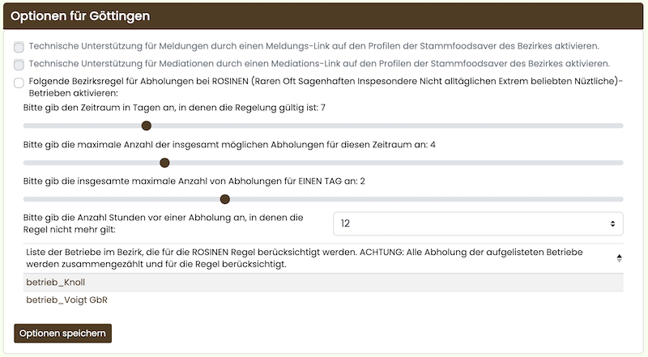
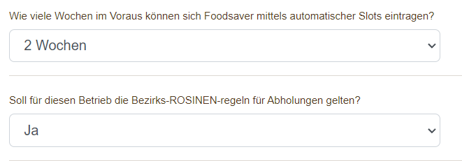
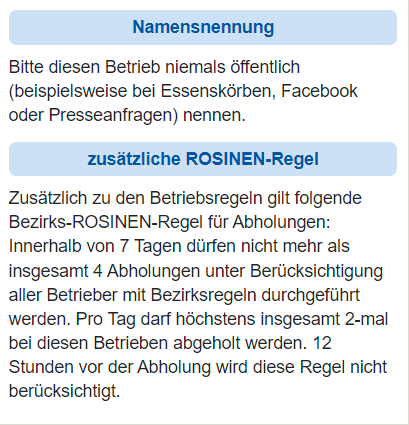
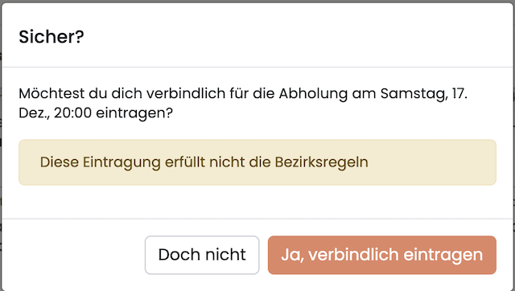

## Android App
Die oft nachgefragte Funktion „Push-Benachrichtigungen“ wird nun von unserer Android-App unterstützt.

## Allgemein
Die Übersichtsseite, nach dem Anmelden, nennt sich Dashboard. Dieses hat viele neue Funktionen und ein neues Aussehen bekommen. Interessante und neue Funktionen werden als Hinweisblock (Banner) angezeigt. Diese Blöcke können ausgeblendet werden. Ebenso sind alle Listen einklappbar und merken sich ihren Zustand. Auf dem Dashboard wird nun zusätzlich die Anzahl freier Abholslots und Anzahl der Abholenden des entsprechenden Betriebs angezeigt. Dies war bisher nur versteckt über das Menü möglich.

Es sind neue Funktion hinzugekommen. Es können jetzt Tabs komplett ausgeblendet werden, aber auch die Spalten-Anzahl verändert werden. Wenn es keine Essenskörbe in einem Radius von 30 Kilometer gibt, wird ein Text angezeigt - anstelle aller neuen Essenskörbe von Foodsharing.
[Referenz: 2227](https://gitlab.com/foodsharing-dev/foodsharing/-/merge_requests/2227) [Referenz: 2252](https://gitlab.com/foodsharing-dev/foodsharing/-/merge_requests/2252)

---

Überarbeitung und Vereinheitlichung der Navigation. Der Funktionsumfang blieb gleich. Verbesserte Bedienung auf einem Smartphone. Anmelden, Abmelden, Bezirke und Gruppen befinden sich bei Geräten mit kleinen Bildschirmen im Menüpunkt mit den drei Strichen (Burgermenü).
[Referenz: 2296](https://gitlab.com/foodsharing-dev/foodsharing/-/merge_requests/2296) [Referenz: 2238](https://gitlab.com/foodsharing-dev/foodsharing/-/merge_requests/2238)

---

Die Farben der gesamten Website wurden angeglichen. Dies betrifft hauptsächlich Links und Buttons.
[Referenz: 2293](https://gitlab.com/foodsharing-dev/foodsharing/-/merge_requests/2293)

---

Ergänzung einer neuen Schriftart, zur Vereinheitlichung der Darstellung.
[Referenz: 2426](https://gitlab.com/foodsharing-dev/foodsharing/-/merge_requests/2426)

---

Die Fußzeile wurde vereinfacht.
[Referenz: 2297](https://gitlab.com/foodsharing-dev/foodsharing/-/merge_requests/2297)

---

Die Fußzeile der Website wird jetzt bei "Mitmachen" "Für Entwickler:innen" angezeigt, um einen einfacheren Weg zur IT zu schaffen.
[Referenz: 2241](https://gitlab.com/foodsharing-dev/foodsharing/-/merge_requests/2241)

---

Links auf externe Websites werden mit einem Symbol gekennzeichnet.
[Referenz: 2280](https://gitlab.com/foodsharing-dev/foodsharing/-/merge_requests/2280)

---

Modernisierung der „Bezirk beitreten“-Funktion.
[Referenz: 2294](https://gitlab.com/foodsharing-dev/foodsharing/-/merge_requests/2294)

---

Die Übersicht der Aktualisierungen auf dem Dashboard lädt nicht mehr endlos. Somit ist das Ende der Seite erreichbar :).
[Referenz: 2305](https://gitlab.com/foodsharing-dev/foodsharing/-/merge_requests/2305)

---

Modernisierung der Chat-Funktion auf der Foodsharing Website.
[Referenz: 2301](https://gitlab.com/foodsharing-dev/foodsharing/-/merge_requests/2301)

---

Wenn beim Anmelden die Option „Dauerhaft eingeloggt bleiben“ aktiviert wird, bleibt die Anmeldung 14-Tage erhalten. Hier wird im Browser ein entsprechendes Cookie gespeichert.

Wird diese Option nicht aktiviert, bleibt die Anmeldung einen Tag erhalten. Danach ist eine neue Anmeldung erforderlich.

Die „letzte Anmeldung“ wird nun als „letzte Aktivität“ angezeigt.
Bei jedem Aufruf des Dashboards wird das Datum aktualisiert, sofern die Option „Dauerhaft eingeloggt bleiben“ aktiviert wurde.
[Referenz: 2450](https://gitlab.com/foodsharing-dev/foodsharing/-/merge_requests/2450)

---

Auf der Anmelde-Seite wird die Option „Dauerhaft eingeloggt bleiben“, nach Aktivierung für künftige Besuche der Website gespeichert.
[Referenz: 2249](https://gitlab.com/foodsharing-dev/foodsharing/-/merge_requests/2249)

---

Nach dem Abmelden von der Website verbleibt man auf der aktuell besuchten Seite, sofern diese öffentlich zugänglich ist.
[Referenz: 2388](https://gitlab.com/foodsharing-dev/foodsharing/-/merge_requests/2388)

---

Nutzer:innen mit Apple Betriebssystem (iOS) können nun die „Betriebsübersicht-Detail-Karten“-Funktion nutzen.
[Referenz: 2236](https://gitlab.com/foodsharing-dev/foodsharing/-/merge_requests/2236)

---

In der Übersicht der Foren-Themen wurden Buttons hinzugefügt. Mit diesen kann man per Klick zum ersten oder letzten Beitrag springen. Die Buttons werden bei Foren-Themen ab drei Beiträgen sichtbar.
[Referenz: 2234](https://gitlab.com/foodsharing-dev/foodsharing/-/merge_requests/2234)

---

Die Liste „Gruppen“ im oberen Menü enthält nun auch Untergruppen zur schnelleren Navigation.
[Referenz: 2418](https://gitlab.com/foodsharing-dev/foodsharing/-/merge_requests/2418)

---

Übersichtlichere Darstellung abgelaufener Abstimmungen. Sie sind nun in Seiten unterteilt und von neu nach alt sortiert.
[Referenz: 2385](https://gitlab.com/foodsharing-dev/foodsharing/-/merge_requests/2385)

---

Fehlerbehebung: Bilder von Vorstands- und Teammitgliedern werden zuverlässig angezeigt.
[Referenz: 2488](https://gitlab.com/foodsharing-dev/foodsharing/-/merge_requests/2488)

---

Die Liste der Essenskörbe in der Nähe wird in der App wieder vollständig angezeigt.
[Referenz: 2419](https://gitlab.com/foodsharing-dev/foodsharing/-/merge_requests/2419)

---

Unter dem Auswahlmenü für die Sprache wurde ein Link ergänzt, der zur Übersetzungswebsite führt. Jede:r, die/der möchte, kann so mithelfen, Foodsharing zu übersetzen.
[Referenz: 2417](https://gitlab.com/foodsharing-dev/foodsharing/-/merge_requests/2417) [Referenz: 2416](https://gitlab.com/foodsharing-dev/foodsharing/-/merge_requests/2416)

---

Fügt der Anzeige des Abholdatums die Uhrzeit hinzu.
[Referenz: 2412](https://gitlab.com/foodsharing-dev/foodsharing/-/merge_requests/2412)

---

Ändert den Link von „zurück zur Übersicht“ in „zurück zum Betrieb“.
[Referenz: 2409](https://gitlab.com/foodsharing-dev/foodsharing/-/merge_requests/2513)

---

Für mobile Endgeräte wurde die minimierte Pinnwand-Historie wieder aktivert.
[Referenz: 2393](https://gitlab.com/foodsharing-dev/foodsharing/-/merge_requests/2393)

---

Texte brechen in der Foren-Ansicht korrekt um und sorgen nicht mehr für eine horizontal scrollende Seite.
[Referenz: 2392](https://gitlab.com/foodsharing-dev/foodsharing/-/merge_requests/2392)

---

Eine Ausgabe für die Wahlbeteiligung wurde hinzugefügt, wenn die Umfrage beendet wurde. 
[Referenz: 2377](https://gitlab.com/foodsharing-dev/foodsharing/-/merge_requests/2377)

---

Anzeige einer Nachricht, wenn es keine Abholslots gibt.
[Referenz: 2375](https://gitlab.com/foodsharing-dev/foodsharing/-/merge_requests/2375)

---

Anzeige der Mitglieder in der Kopfzeile analog zu den Bezirken angeglichen.
[Referenz: 2374](https://gitlab.com/foodsharing-dev/foodsharing/-/merge_requests/2374)

---

Fehlerbehebung: Die Buttonfarbe eines Forumsbeitrags ändert sich nicht, auch wenn bereits geantwortet wurde.
[Referenz: 2373](https://gitlab.com/foodsharing-dev/foodsharing/-/merge_requests/2373)

---

Der Tooltip von Buttons für das Bearbeiten der Essenskorbanfragen wurde nach links verschoben, so dass er den Button nicht verdeckt.
[Referenz: 2368](https://gitlab.com/foodsharing-dev/foodsharing/-/merge_requests/2368)

---

Im Profil kann man die eigene E-Mail-Adresse von einer Sperrliste entfernen.
[Referenz: 2360](https://gitlab.com/foodsharing-dev/foodsharing/-/merge_requests/2360)

---

Menülinks von „Mission“ zu „Vision“ geändert.
[Referenz: 2302](https://gitlab.com/foodsharing-dev/foodsharing/-/merge_requests/2302)

---

Ein mehrzeiliger Pinnwandeintrag benutzt jetzt die komplett verfügbare Breite.
[Referenz: 2277](https://gitlab.com/foodsharing-dev/foodsharing/-/merge_requests/2277)

---

Über die Suchfunktion können auch Fairteiler über Name oder Adresse gesucht werden.
[Referenz: 2260](https://gitlab.com/foodsharing-dev/foodsharing/-/merge_requests/2260)

---

Die Beschriftung des Auswahl-Buttons in der Sprachauswahl wurde aktualisiert.
[Referenz: 2250](https://gitlab.com/foodsharing-dev/foodsharing/-/merge_requests/2250)

---

Fehlerbehebung: Die Lebensdauer von Essenskörben wird jetzt korrekt, d.h. auf der Basis von Stunden und Minuten berechnet. Ein Essenskorb, der um 23 Uhr mit einer Lebensdauer von 1 Tag hinzugefügt wird, wird nicht mehr um 24:00 gelöscht. 
[Referenz: 2244](https://gitlab.com/foodsharing-dev/foodsharing/-/merge_requests/2244)

---

Auf der Seite „Profil Einstellungen“ wurde ein passender Hinweis eingefügt, wie eine Namensänderung beantragt werden kann.
[Referenz: 2240](https://gitlab.com/foodsharing-dev/foodsharing/-/merge_requests/2240)

---

Das öffentliche Profil funktioniert jetzt auch für Menschen, deren Vorname mit einem Umlaut anfängt.
[Referenz: 2239](https://gitlab.com/foodsharing-dev/foodsharing/-/merge_requests/2239)

---

Bei mobiler Nutzung ist in einem Forum Thread mehr Platz, da das Profilbild nicht mehr so groß angezeigt wird.
[Referenz: 2237](https://gitlab.com/foodsharing-dev/foodsharing/-/merge_requests/2237)

---

Der Button zum Hochladen von Bildern auf Pinnwänden zeigt jetzt das unterstützte Dateiformat an.
[Referenz: 2229](https://gitlab.com/foodsharing-dev/foodsharing/-/merge_requests/2229)

---

Die Buttonübersicht für Arbeitsgruppen (Bewerbungen, Kontaktieren, ...) auf der Übersichtsseite wurde für mobile Endgeräte optimiert.
[Referenz: 2224](https://gitlab.com/foodsharing-dev/foodsharing/-/merge_requests/2224)

---

Mobile Ansicht: Die Region und der Forumname wird angezeigt selbst bei einem langen Titel. Zu lange Titel werden abgeschnitten.
[Referenz: 2223](https://gitlab.com/foodsharing-dev/foodsharing/-/merge_requests/2223)

---

Fehlerbehebung: Unter „Profil Einstellungen“ werden jetzt alle Elemente angezeigt.
[Referenz: 2218](https://gitlab.com/foodsharing-dev/foodsharing/-/merge_requests/2218)

---

Fehlerbehebung: Die Schlafmützenfunktion kann wieder benutzt werden, auch wenn die Website nicht auf Deutsch eingestellt ist.
[Referenz: 2225](https://gitlab.com/foodsharing-dev/foodsharing/-/merge_requests/2225)

---

Die Abschnitte „Nächste Abholtermine“ und „Abholungshistorie“ der Profilseite wurden zu einem Abschnitt „Abholtermine“ zusammengefasst. Hier könnt ihr euch außerdem anzeigen lassen, wann in welchen eurer Betriebe Slots frei sind, für die ihr euch eintragen könnt.
[Referenz: 2211](https://gitlab.com/foodsharing-dev/foodsharing/-/merge_requests/2211)

---

Fehlerbehebung: Im Registrierungsformular wurden kleinere Fehler behoben.
[Referenz: 2184](https://gitlab.com/foodsharing-dev/foodsharing/-/merge_requests/2184)

---

Derzeit laufende Termine werden jetzt in der Terminübersicht angezeigt, bis sie vorüber sind.
Vergangene Termine werden unterhalb der Terminübersicht angezeigt und können dort auch gefiltert werden.
[Referenz: 2162](https://gitlab.com/foodsharing-dev/foodsharing/-/merge_requests/2162)

---

Beim Verlassen eines Bezirks wird auch die Teilnahme an entsprechenden Terminen entfernt.
[Referenz: 2381](https://gitlab.com/foodsharing-dev/foodsharing/-/merge_requests/2381)

---

Die Betriebsseite ist nun in Kalenderexporten verlinkt. Außerdem werden Foodsharing-Veranstaltungen im Kalender aufgeführt.
[Referenz: 2182](https://gitlab.com/foodsharing-dev/foodsharing/-/merge_requests/2182)

## Betriebsverantwortliche

Die Anzahl ungelesener E-Mails wird nun in der Navigation, ähnlich wie bei neuen Chat-Nachrichten, angezeigt.
[Referenz: 2188](https://gitlab.com/foodsharing-dev/foodsharing/-/merge_requests/2188)

---

Warn-Mails werden wieder an Betriebsverantwortliche verschickt, wenn sich für die nächste Abholung noch niemand eingetragen hat.
[Referenz: 2422](https://gitlab.com/foodsharing-dev/foodsharing/-/merge_requests/2422)

---

Die Betriebsliste auf der Profilseite eines Foodsavers wird Betriebsverantwortlichen angezeigt, für deren Betrieb sich der Foodsaver beworben hat.
[Referenz: 2437](https://gitlab.com/foodsharing-dev/foodsharing/-/merge_requests/2437)

---

„Öffentliche Informationen“ werden nun bei der Erstellung eines Betriebes richtig hinterlegt und auf der Karte angezeigt.
[Referenz: 2397](https://gitlab.com/foodsharing-dev/foodsharing/-/merge_requests/2397)

---

Entfernt sich jemand als Betriebsverantwortliche:r eines Betriebes, wird dies protokolliert.
[Referenz: 2365](https://gitlab.com/foodsharing-dev/foodsharing/-/merge_requests/2365)

---

Es wurde sich ein Feature gewünscht, welches anzeigt, wann ein Foodsaver aus einem Slot ausgetragen wird, um das unangekündigte Austragen aus Abholslots transparent zu machen. Es werden in der Abholungshistorie nun auch die Austragungen der letzten 7 Tage angezeigt. Diese sind nur für Betriebsverantwortliche sichtbar.
[Referenz: 2363](https://gitlab.com/foodsharing-dev/foodsharing/-/merge_requests/2363)

---

Das Anhang-Icon wird nun nur noch in Mails angezeigt, die tatsächlich einen Anhang haben.
[Referenz: 2242](https://gitlab.com/foodsharing-dev/foodsharing/-/merge_requests/2242)

---

Um dein Engagement, das über Abholungen hinaus geht, für Betriebsverantwortliche deines Stammbezirkes transparenter zu gestalten, wird nun dein Engagement für kurzfristiges Eintragen, Teilnahme an Treffen, dem Verwalten von Betrieben, dem Erstellen von Essenskörben, der Pflege der Fairteiler wertgeschätzt.  Die Engagementstatistik findet ihr im Profil eines Foodsavers.   Vielen Dank dir für die Übernahme von Aufgaben, die ein Wachsen der foodsharing Community ermöglicht, denn foodsharing ist das, was du daraus machst.
[Referenz: 2217](https://gitlab.com/foodsharing-dev/foodsharing/-/merge_requests/2217)

## Botschafter*innen

Anpassungen für die Funktion der Ausweis-Erstellung
Bei der Erstellung von einzelnen Foodsaver-Ausweisen wird das erzeugte pdf-Dokument auf die Größe eines einzelnen Ausweises reduziert.
Wenn Ausweise für mehr als einen Foodsaver erstellt werden, wird weiterhin ein A4-Blatt erstellt.

- Wird ein Foodsaver verifziert, wird diesem eine Glocken-Benachrichtigung angezeigt und zusätzlich eine Mail geschickt.

- Verifizierte Foodsaver*innen haben in "Profil Einstellungen" Zugriff auf ihren Foodsaver-Ausweis. Der Ausweis kann so vom Handy aus vorgezeigt werden.
[Referenz: 2198](https://gitlab.com/foodsharing-dev/foodsharing/-/merge_requests/2198) [Referenz: 2197](https://gitlab.com/foodsharing-dev/foodsharing/-/merge_requests/2197)

---

Vereinheitlichung der Adressänderungsseite für Foodsaver und Botschafter:innen
[Referenz: 2171](https://gitlab.com/foodsharing-dev/foodsharing/-/merge_requests/2171)

---

Die Seite „Foodsaver“ wurde aus den Menüs entfernt und deren Funktionen wurden in die Seite „Mitglieder“ integriert.
[Referenz: 2512](https://gitlab.com/foodsharing-dev/foodsharing/-/merge_requests/2512)

---

im Menüpunkt 'Bezirksoptionen' ist es nun möglich, eine Abholregel auf Bezirksebene für Abholungen bei ROSINEN (Raren Oft Sagenhaften Inspesondere Nicht alltäglichen Extrem beliebten Nützlichen)-Betrieben zu aktivieren. Dabei kann angegeben werden:
- die maximale Anzahl an Abholungen innerhalb eines zu wählenden Zeitraumes,
- die maximale Anzahl an Abholungen pro Tag. 
- wieviele Stunden vor der Abholung die Regel vom System ignoriert werden soll (bsp.: 24h) um die Abholung sicherzustellen. 
Zur Summe der Abholungen in ROSINEN_Betrieben zählen Abholungen in allen ROSINEN-Betrieben, das heißt bezirksübergreifend.  Betriebe des eigenen Bezirks, die bei der ROSINEN-Regel berücksichtigt werden, werden unter 'Bezirksoptionen' aufgelistet. 

Bei Betrieben muss angegeben werden, ob diese bei der bezirksweiten ROSINEN-Abholregel berücksichtigt werden sollen. 

Ist eine Bezirksregel auf aktiv gesetzt und soll für einen bestimmten Betrieb berücksichtigt werden, so wird dies in den entsprechenden  Betriebsinformationen angezeigt. Die Einhaltung der Bezirksregel wird automatisch vom System überprüft und gilt zusätzlich zu anderen Betriebsregeln. 

Bei Überprüfung der Bezirksregel werden Abholungen in allen Betrieben gezählt, bei denen zu diesem Zeitpunkt die Bezirksregel aktiviert war. Dies gilt bezirksübergreifend.
Bei dem Versuch sich einzutragen wird die Bezirksregel geprüft. Sollte die maximale Anzahl an Abholungen erreicht worden sein, so wird dies angezeigt. Der Button zum Eintragen wird deaktiviert.

Beispiel: 
Ein Bezirk hat 3 sehr beliebte Betriebe. Um hier ein Gleichgewicht und Fairness sicherzustellen, wird sich darauf geeinigt, dass jeder nur 2 mal insgesamt innerhalb von 7 Tagen bei diesen Betrieben abholen darf. Dabei spielt es keine Rolle, bei welchen der drei Supermärkte die Abholung stattfindet, solange die Gesamtanzahl in dem Zeitraum nicht überschritten wird. Es darf nicht mehr als 2 mal insgesamt PRO TAG bei diesen Betrieben abgeholt werden. Um sicherzustellen, dass sich niemand für eine Abholung eintragen kann, weil alle schon die maximale Anzahl an Abholungen in ROSINEN-Betrieben erreicht haben, soll die Bezirksregel 5 Stunden vor der Abholung ignoriert werden. 

Es wird als Bezirksregel
- bei „Bitte gib den Zeitraum in Tagen an, in denen die Regelung gültig ist“: 7, 
- bei „Bitte gib die maximale Anzahl der insgesamt möglichen Abholungen für diesen Zeitraum an:“ 2 
- bei „Bitte gib die insgesamt maximale Anzahl von Abholungen für EINEN TAG an:“ 2 
- bei „Bitte gib die Anzahl Stunden vor einer Abholung an, in denen die Regel nicht mehr gilt:“ 5

eingegeben. 

Bei den Betrieben wird die Einstellung bei „Sollen für diesen Betrieb die Bezirksregeln für Abholungen gelten?“ bei beiden Betrieben auf „Ja“ gestellt. 
Sollte ein weiterer Betrieb hinzugenommen werden, kann die Bezirksregel entsprechend angepasst oder einfach nur bei dem neu hinzugekommenen Betrieb aktiviert werden. 

Dies hat keinen Einfluss auf Abholungen bei Betrieben, die nicht für die Bezirksregel berücksichtigt werden sollen und ihre eigenen Regeln haben. 
Sollten Betriebe in verschiedenen Bezirken liegen, aber eingestellt haben, dass sie die Bezirksregel berücksichtigen, wird die jeweilige Regel des Bezirks diese mit einbeziehen. Jeder Bezirk überprüft seine Regel, berücksichtigt aber alle Abholungen bei den Betrieben, bei denen die Berücksichtigung aktiviert ist.
[Referenz: 2414](https://gitlab.com/foodsharing-dev/foodsharing/-/merge_requests/2414)

---

Der Link „Nachricht ans Team“ oder „Nachricht an Springer“ im Betrieb wird jetzt nur noch angezeigt, wenn man im Team ist.
[Referenz: 2304](https://gitlab.com/foodsharing-dev/foodsharing/-/merge_requests/2304)

---

Die Mitgliederverwaltung von Arbeitsgruppen befindet sich jetzt nicht mehr unter „Gruppe verwalten“, sondern unter „Mitglieder“.
[Referenz: 2228](https://gitlab.com/foodsharing-dev/foodsharing/-/merge_requests/2228)

---

Über die Mitgliederliste eines Bezirkes ist es Orga-Berechtigten nun möglich, Botschafter einzusetzen und auszutragen.
Admins können nun Mitglieder als Admins ein- bzw. austragen. Dies geschieht über die Mitgliederliste der AG.
[Referenz: 2143](https://gitlab.com/foodsharing-dev/foodsharing/-/merge_requests/2143)

## Orga

Zur Nachvollziehbarkeit wird in Zukunft gespeichert, wer und ggfs. warum jemand ein Profil gelöscht hat.
[Referenz: 2157](https://gitlab.com/foodsharing-dev/foodsharing/-/merge_requests/2157)
